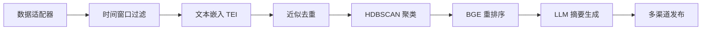

# AI-Briefing - 智能简报生成平台

[](https://www.docker.com/)
[](https://www.rust-lang.org/)
[](https://www.python.org/)
[](LICENSE)

每天 3 分钟，速览全球 AI 关键信息。项目自动聚合公开权威源（Hacker News / Twitter / Reddit），事件聚类 + LLM 摘要，原文一键直达；支持网站、RSS 与 Telegram 订阅。

AI 每日简报通过 ML 驱动的处理管道，从公开来源（如 Hacker News、Twitter、Reddit）自动聚合信息，完成文本嵌入、去重、话题聚类与重排序后，由 LLM（Gemini/OpenAI 兼容）生成摘要与要点；同时保留原文链接，便于读者快速核验。内容按日归档、按月聚合，并通过网站、RSS 与 Telegram 多渠道触达。

## ✨ 核心特性

- **多源聚合**：支持 Hacker News / Twitter / Reddit 等公开渠道
- **智能处理**：嵌入 → 去重 → 话题聚类（HDBSCAN）→ 重排序（BGE-Reranker）→ 摘要生成
- **🆕 提示优化**：关键词过滤 + TF-IDF 加权查询 + 可配置模式，精准聚焦 LLM 发布和 Agentic Coding 话题
- **原文可追溯**：保留原始链接，便于快速核验与延伸阅读
- **多渠道分发**：网站阅读、RSS 订阅、Telegram 推送；历史内容自动归档（GitHub / 月度）
- **良好体验**：站内搜索、PWA、全球边缘加速部署

> 说明：本项目为自动化聚合与生成，不进行人工采编，不直连封闭数据库；以公开可验证的信源为基础，并保留原文链接便于核验。

## 🔗 在线渠道

- 网站：https://aiheadline.news/
- Telegram：https://t.me/ai_daily_briefing
- 归档（月度文件）：https://github.com/Joe-oss9527/ai-briefing-archive

## 🚀 快速开始

### 1. 一键安装（推荐）
```bash
# 自动安装所有依赖 (Rust + TEI + AI模型)
make setup
```

### 2. 启动服务
```bash
# 启动所有服务 (默认包含容器化 TEI)
make start
```

### 3. 开始收集数据
```bash
# 收集单个数据源
make hn            # Hacker News
make twitter       # AI 快讯 · Twitter  
make reddit        # Reddit GameDev

# 或并行收集所有数据源
make all
```

### 4. 查看结果
```bash
# 显示最新生成的摘要文件
make show

# 查看具体内容
make view-hn       # 查看 HN 摘要
make view-twitter  # 查看 Twitter 摘要
make view-reddit   # 查看 Reddit 摘要
```

## 📋 系统要求

- **macOS**: 12.0+ (推荐 Apple Silicon for Metal GPU acceleration)
- **Docker**: 20.10+
- **Docker Compose**: v2 (使用 `docker compose` 而非 `docker-compose`)
- **网络**: 稳定的互联网连接用于模型下载

**可选依赖** (make setup 自动安装):
- Rust 1.70+
- git-lfs

## ⚙️ 配置说明

### 环境变量配置
复制 `.env.example` 到 `.env` 并配置必要的 API 密钥：

```bash
# Reddit 数据源 (必需)
REDDIT_CLIENT_ID=your_reddit_client_id
REDDIT_CLIENT_SECRET=your_reddit_client_secret

# 至少配置一个 LLM 提供商（与各自 config 中 llm_provider 对应）
# OpenAI 兼容（用于 ai-briefing-hackernews.yaml，默认 openai）：
OPENAI_API_KEY=your_openai_api_key
# 可选：自建或第三方 OpenAI 兼容服务
OPENAI_BASE_URL=https://api.openai.com/v1

# Google Gemini（用于 ai-briefing-reddit.yaml，默认 gemini）：
GEMINI_API_KEY=your_gemini_api_key  # 或 GOOGLE_API_KEY

# Telegram 推送 (可选)
TELEGRAM_BOT_TOKEN=your_bot_token

# GitHub 备份 (可选)
GITHUB_TOKEN=your_github_token

# Twitter 认证 (可选)
TWITTER_USERNAME=your_username
TWITTER_PASSWORD=your_password
TEI_MODE=compose
TEI_MODEL_ID=sentence-transformers/all-MiniLM-L6-v2
TEI_ORIGIN=http://tei:3000
HF_TOKEN=your_huggingface_token
```

### TEI 服务模式

- **compose (默认)**：`make start` 会通过 Docker Compose 启动 `tei` 容器，端口映射为 `http://localhost:8080`，容器内请求使用 `http://tei:3000`。
- **local (备用)**：设置 `TEI_MODE=local` 并将 `TEI_ORIGIN` 改为 `http://host.docker.internal:8080`，`make start` 会调用 `scripts/start-tei.sh` 在宿主机启动 Metal GPU 加速的 `text-embeddings-router`。
- 切换模式后建议运行 `make check-services`，确认 `http://localhost:8080/health` 返回正常。

#### 嵌入批处理安全阈值

- `EMBED_MAX_BATCH_TOKENS`：单次发送到 TEI 的最大 token 数（默认 8192，与 `scripts/start-tei.sh` 中 `--max-batch-tokens` 一致）。
- `EMBED_MAX_ITEM_CHARS`：单条内容送入嵌入服务前的最大字符数（默认 6000，超出部分自动截断）。
- `EMBED_CHAR_PER_TOKEN`：字符到 token 的估算因子（默认 4.0，可按模型特性微调）。
- 在 `configs/<task>.yaml` 的 `processing.embedding` 中可进行任务级覆盖，例如：

```yaml
processing:
  embedding:
    max_batch_tokens: 8192
    max_item_chars: 6000
    chars_per_token: 4.0
```

> 这些阈值用于防止将超大批量文本发送到 TEI 时触发 413 错误（Payload Too Large）。如需调高 `--max-batch-tokens`，请同步更新环境变量或任务配置。

### 任务配置
在 `configs/` 目录下自定义任务配置：

```yaml
briefing_id: "custom_task"
briefing_title: "自定义简报"
source:
  type: "hackernews"
  hn_story_type: "top"
  hn_limit: 50
processing:
  time_window_hours: 24
  min_cluster_size: 3
  sim_near_dup: 0.90
summarization:
output:
  formats: ["md", "json", "html"]
```

## 🎯 提示优化功能 (Prompt Optimization)

> **最新功能 (2025-11-22)**: 增强的内容过滤、TF-IDF 加权查询和可配置关键词模式

### 关键词过滤 (Keyword Filtering)

智能过滤内容，优先聚焦 LLM 发布、Agentic Coding 工具等相关主题：

```yaml
processing:
  keyword_filter:
    enabled: true
    min_score: 0.5           # 最低相关性分数
    top_k: 500               # 保留 top 500 条目
    boost_official_sources: true  # 官方来源 1.5x 加权
```

**内置关键词类别**:
- **llm_releases** (权重 3.0): Claude、GPT、Gemini、Llama 模型发布
- **agentic_coding** (权重 2.5): Claude Code、Cursor、Devin、Copilot
- **vibe_coding** (权重 2.0): 快速原型、对话式编程
- **cli_tools** (权重 2.0): 命令行工具、终端自动化

### TF-IDF 加权查询

使用 TF-IDF 为重排序生成加权查询，提升精准度：

```yaml
processing:
  rerank:
    strategy: ce+mmr
    use_tfidf_query: true   # 启用 TF-IDF 查询
    tfidf_top_n: 10         # 提取前 10 个关键词
```

### 自定义关键词模式

通过 YAML 配置自定义关键词，无需修改代码：

```yaml
processing:
  keyword_filter:
    enabled: true
    keyword_categories:
      custom_category:
        weight: 2.0
        keywords:
          - "\\bYourKeyword\\b"
          - "\\bAnotherPattern\\b"
    official_domains:
      - "your-domain.com"
```

### A/B 测试工具

使用内置工具评估优化效果：

```bash
python tools/compare_ab.py \
  --baseline-config configs/ai-briefing-hackernews-baseline.yaml \
  --optimized-config configs/ai-briefing-hackernews-optimized.yaml \
  --output reports/comparison.json
```

**追踪指标**:
- Agentic 内容占比 (目标: ≥40%)
- 官方来源占比 (目标: ≥60%)
- 处理时间 (目标: <150s)

📚 **详细文档**:
- [配置示例](docs/CONFIGURATION_EXAMPLES.md)
- [验证报告](docs/VALIDATION_REPORT.md)
- [实现总结](docs/IMPLEMENTATION_SUMMARY.md)

## 🏗️ 架构设计

### 处理流程


### 核心组件
- **Orchestrator**: 任务编排器，管理整个处理流程
- **Data Adapters**: 统一的数据源接口 (HN/Twitter/Reddit)
- **Processing Pipeline**: ML 驱动的内容处理管道
- **Summarizer**: LLM 交互层 (支持 Gemini/OpenAI)
- **Publisher**: 多渠道内容分发器

### 服务架构
- **TEI**: 默认容器化部署，可选本地 Metal GPU 加速
- **RSSHub**: Twitter 数据代理服务（依赖 Redis + Browserless）
- **Redis/Browserless**: RSSHub 的缓存与无头浏览器后端

## 📊 输出格式

生成的简报文件位于 `out/<briefing_id>/` 目录：

```
out/ai-briefing-hackernews/
├── briefing_20250823T120000Z.md    # Markdown 格式
├── briefing_20250823T120000Z.json  # 结构化数据
└── briefing_20250823T120000Z.html  # HTML 格式
```

## 🛠️ 高级用法

### 开发调试
```bash
make shell         # 进入 worker 容器
make logs          # 查看实时日志
make check-services # 检查服务健康状态
```

### 服务管理
```bash
make status        # 查看服务状态
make restart       # 重启所有服务
make stop          # 停止所有服务
```

### 维护操作
```bash
make clean-output  # 清理 7 天前的输出文件
make clean-tei     # 清理 TEI 相关文件
make check-deps    # 检查系统依赖状态
```

## 🔧 故障排除

### TEI 服务问题
- **compose 模式**：
  ```bash
  docker compose --profile tei logs -f tei   # 查看容器日志
  curl http://localhost:8080/health         # 健康检查
  ```
- **local 模式**：
  ```bash
  ls ~/.cargo/bin/text-embeddings-router    # 检查二进制
  make clean-tei && make install-tei        # 重新编译安装
  ```

### Docker 网络问题
确保使用 Docker Compose v2：
```bash
docker compose version  # 应显示 v2.x.x
```

### 批处理大小错误
如果看到 "batch size > maximum allowed batch size" 错误，这是正常的批处理优化，不影响功能。

## 🤝 贡献指南

1. Fork 本仓库
2. 创建功能分支 (`git checkout -b feature/AmazingFeature`)
3. 提交更改 (`git commit -m 'Add some AmazingFeature'`)
4. 推送到分支 (`git push origin feature/AmazingFeature`)
5. 创建 Pull Request

## 📄 许可证

本项目采用 MIT 许可证 - 查看 [LICENSE](LICENSE) 文件了解详情。

## 🙏 致谢

- [Text Embeddings Inference](https://github.com/huggingface/text-embeddings-inference) - 高性能文本嵌入服务
- [RSSHub](https://github.com/DIYgod/RSSHub) - 万物皆可 RSS
- [HDBSCAN](https://github.com/scikit-learn-contrib/hdbscan) - 基于密度的聚类算法

---

**📧 反馈与支持**: 如有问题或建议，请创建 [Issue](https://github.com/Joe-oss9527/ai-briefing/issues)
